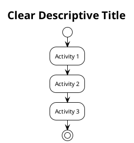
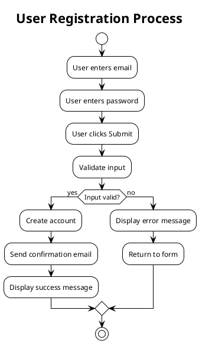
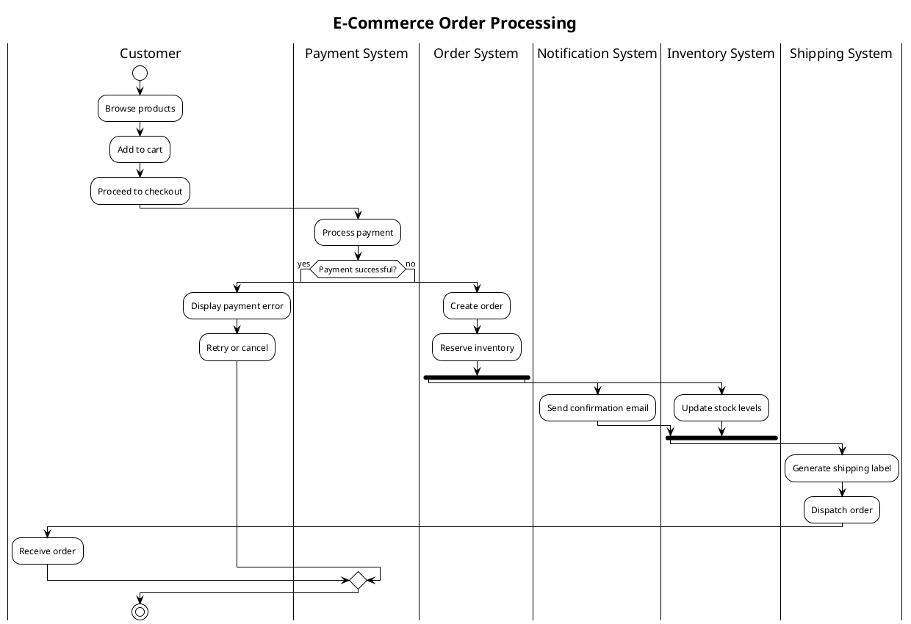
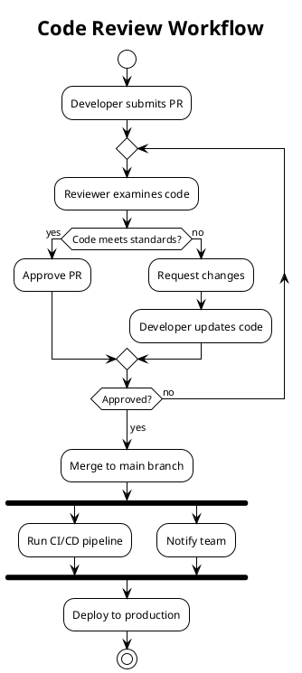
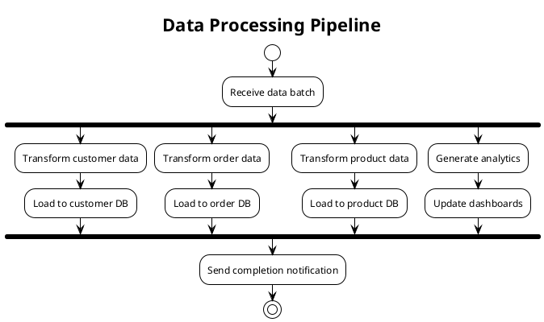

# Activity Diagram Instructions

Use this when creating activity diagrams to show process flows, workflows, algorithms, and decision logic.

## When to Use Activity Diagrams

- Business process flows
- Workflow automation
- Algorithm logic
- Decision trees with actions
- State transitions
- User journey flows
- System behavior flows

## PlantUML Activity Diagram Syntax

### Basic Structure



### Key Elements

**Actions/Activities**:
```plantuml
:Action description;
:Multi-line
action description;
```

**Decision Points**:
```plantuml
if (Condition?) then (yes)
  :Action if true;
else (no)
  :Action if false;
endif
```

**Loops**:
```plantuml
repeat
  :Action in loop;
repeat while (Continue?) is (yes)
->no;
```

**Parallel Processing**:
```plantuml
fork
  :Parallel task 1;
fork again
  :Parallel task 2;
fork again
  :Parallel task 3;
end fork
```

**Partitions (Swimlanes)**:
```plantuml
|User|
start
:Login;

|System|
:Validate credentials;

|Database|
:Query user;

|System|
:Return result;
stop
```

**Notes**:
```plantuml
note right
  Additional context
  or explanation
end note
```

**Colors**:
```plantuml
:Activity; #LightBlue
if (Decision?) then (yes) #LightGreen
  :Success path;
else (no) #Pink
  :Error path;
endif
```

## Step-by-Step Process

1. **Identify start/end points** - Where does the flow begin and end?
2. **List main activities** - What are the key steps?
3. **Add decision points** - Where are choices made?
4. **Include loops** - Any repeated activities?
5. **Add partitions** - Different actors/systems involved?
6. **Color-code paths** - Highlight important flows

## Examples

### Example 1: Simple Linear Flow



### Example 2: Complex Flow with Swimlanes



### Example 3: Workflow with Loops



### Example 4: Decision-Heavy Flow

```plantuml
@startuml User Authentication
!theme plain
skinparam defaultTextAlignment center

title User Authentication Flow

start

:User enters credentials;
:Submit login form;

if (User exists?) then (yes)
  if (Password correct?) then (yes)
    if (2FA enabled?) then (yes)
      :Send 2FA code;
      :User enters code;

      if (Code valid?) then (yes)
        :Grant access; #LightGreen
      else (no)
        :Deny access; #Pink
      endif
    else (no)
      :Grant access; #LightGreen
    endif
  else (no)
    :Increment failed attempts;

    if (Too many failures?) then (yes)
      :Lock account; #Pink
      :Send alert email;
    else (no)
      :Show error; #LightYellow
    endif
  endif
else (no)
  :Show error; #Pink
endif

stop

@enduml
```

### Example 5: Parallel Processing



## Advanced Features

### Backward Navigation

```plantuml
:Step 1;
:Step 2;
if (Error?) then (yes)
  backward :Return to Step 1;
else (no)
  :Continue;
endif
```

### Detach (Early Termination)

```plantuml
if (Critical error?) then (yes)
  :Log error;
  detach
else (no)
  :Continue processing;
endif
```

### Grouping Activities

```plantuml
partition "Data Validation" {
  :Check format;
  :Check constraints;
  :Check duplicates;
}

partition "Data Processing" {
  :Transform data;
  :Enrich data;
  :Store data;
}
```

## Color Palette Suggestions

Use hex pastels (consistent with sequence diagram palette):

| Color | Hex | Use |
|-------|-----|-----|
| Green | `#E5FFE5` | Success paths, completion states |
| Blue | `#E5F5FF` | Normal flow, processing |
| Pink | `#FFE5E5` | Error/failure paths |
| Yellow | `#FFFFE5` | Warning/retry paths |
| Orange | `#FFF5E5` | Critical actions, workers |
| Purple | `#F5E5FF` | External triggers |

## Best Practices

- **Keep flows readable** (max 15-20 activities)
- **Use clear action names** (verb + object)
- **Show decision criteria** in diamond shapes
- **Color-code paths** for visual clarity
- **Use partitions** for multi-actor flows
- **Add notes** for complex logic
- **Indicate error handling** explicitly
- **Show loops clearly** with repeat/while
- **Use parallel forks** when tasks are independent

## Common Patterns

**Simple Decision**:
```plantuml
if (Condition?) then (yes)
  :Action A;
else (no)
  :Action B;
endif
```

**Loop Until Success**:
```plantuml
repeat
  :Try action;
repeat while (Success?) is (no)
->yes;
```

**Error Handler**:
```plantuml
:Main action;
if (Error?) then (yes)
  :Log error;
  :Notify admin;
  stop
else (no)
  :Continue;
endif
```

**Parallel Tasks**:
```plantuml
fork
  :Task 1;
fork again
  :Task 2;
end fork
:Sync point;
```

## When to Split Diagrams

If your activity diagram has:
- More than 20 activities → Split into sub-processes
- More than 5 swimlanes → Create separate diagrams per actor
- Deep nesting (4+ levels) → Extract sub-flows

Create focused diagrams that tell one clear story.
