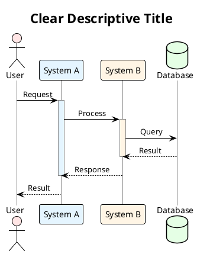
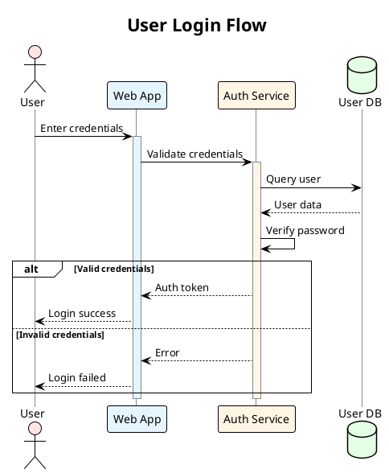
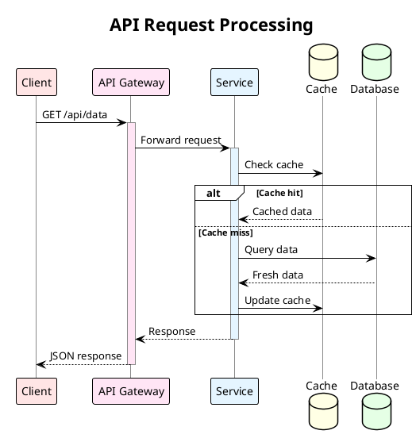

# Sequence Diagram Instructions

Use this when creating sequence diagrams to show interactions, flows, and communication between components over time.

## When to Use Sequence Diagrams

- Showing interactions between actors/systems
- Illustrating process flows with steps
- Documenting API calls or message exchanges
- Explaining authentication/authorization flows
- Visualizing user journeys

## PlantUML Sequence Diagram Syntax

### Pastel Color Palette

**Always use pastel colors** for participants and activation bars to improve visual clarity:

| Color | Hex Code | Use Case |
|-------|----------|----------|
| 🔴 Pink | `#FFE5E5` | Actors, primary components, users |
| 🔵 Blue | `#E5F5FF` | Services, handlers, processors |
| 🟡 Orange | `#FFF5E5` | Processing components, workers |
| 🟢 Green | `#E5FFE5` | Databases, storage, persistence |
| 🟣 Purple | `#F5E5FF` | External systems, third-party |
| 🩷 Magenta | `#FFE5F5` | APIs, gateways, interfaces |
| 🌿 Mint | `#E5FFF5` | Utilities, helpers, tools |
| 🟨 Yellow | `#FFFFE5` | Logs, outputs, results |
| 🩵 Cyan | `#F5FFFF` | State, configuration, metadata |

**How to apply**:
```plantuml
' Add to beginning of diagram
skinparam SequenceLifeLineBorderColor #888888
skinparam SequenceLifeLineBackgroundColor #F5F5F5

' Apply to participants
participant "Service" as S #E5F5FF

' Apply to activation bars
activate S #E5F5FF
```

### Basic Structure



**Pastel Color Palette**:
- Pink: `#FFE5E5` - Actors, primary components
- Blue: `#E5F5FF` - Services, handlers
- Orange: `#FFF5E5` - Processing components
- Green: `#E5FFE5` - Databases, storage
- Purple: `#F5E5FF` - External systems
- Magenta: `#FFE5F5` - APIs, gateways
- Mint: `#E5FFF5` - Utilities, helpers
- Yellow: `#FFFFE5` - Logs, outputs
- Cyan: `#F5FFFF` - State, config

### Key Elements

**Participants**:
- `actor` - Human users
- `participant` - Systems/services
- `database` - Data stores
- `entity` - Business objects
- `boundary` - External systems
- `control` - Controllers/handlers

**Arrows**:
- `->` - Synchronous call
- `-->` - Return/response
- `->>` - Asynchronous message
- `-->>` - Asynchronous return

**Activation**:
- `activate A` - Start processing
- `deactivate A` - End processing

**Notes**:
```plantuml
note right of A
  Explain complex logic here
end note

note over A, B
  Spans multiple participants
end note
```

**Groups**:
```plantuml
group Optional Processing
  A -> B: Optional call
end

alt Success case
  A -> B: Success path
else Error case
  A -> B: Error path
end

loop For each item
  A -> B: Process item
end
```

## Step-by-Step Process

1. **Identify participants** - Who/what is involved?
2. **Determine interaction order** - What's the sequence of events?
3. **Choose arrow types** - Sync vs async?
4. **Add activation boxes** - Show when components are processing
5. **Include notes** - Explain non-obvious logic
6. **Use groups** - Organize complex flows (loops, conditions)

## Template

See [template.pu](template.pu) for a complete template.

## Examples

### Example 1: User Authentication



### Example 2: API Request Flow



## Best Practices

- Keep diagrams focused (5-10 participants max)
- Use clear, descriptive names
- Show returns with dashed arrows (`-->`)
- Add notes for complex logic
- Use activation boxes to show processing (with matching colors)
- Group related interactions
- Include error/alternative paths when relevant
- Apply pastel colors to participants and activation bars for visual clarity
- Use consistent color scheme across related diagrams

## Common Patterns

**Request-Response**:
```plantuml
A -> B: Request
activate B #E5F5FF
B --> A: Response
deactivate B
```

**Async Processing**:
```plantuml
A ->> B: Async message
B -->> A: Acknowledgment
note right of B
  Processing continues
end note
```

**Conditional Logic**:
```plantuml
alt Condition A
  A -> B: Path A
else Condition B
  A -> C: Path B
end
```

**Loops**:
```plantuml
loop For each item
  A -> B: Process item
  B --> A: Result
end
```
