# Tree/Hierarchy Diagram Instructions

Use this when creating tree or hierarchy diagrams to show structure, organization, breakdown, or top-down views.

## When to Use Tree Diagrams

- Organizational charts
- Project breakdown structures
- File/folder hierarchies
- Concept taxonomies
- Decision trees
- Knowledge organization

> For system architecture (containers, components, context boundaries), use C4 diagrams instead — see `c4/c4.md`.

## PlantUML Tree Diagram Options

PlantUML offers three main formats for hierarchical diagrams:

### 1. WBS (Work Breakdown Structure) - Best for Projects

Use for: Project planning, task breakdown, deliverables

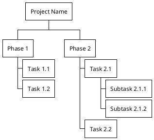

### 2. Mind Map - Best for Concepts

Use for: Brainstorming, concept mapping, idea organization

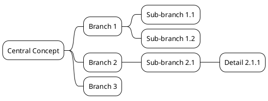

### 3. Salt (Component Hierarchy) - Best for UI/Structure

Use for: UI layouts, file trees, system structure

```plantuml
@startsalt
{
  {T
    + Root
    ++ Child 1
    +++ Grandchild 1.1
    +++ Grandchild 1.2
    ++ Child 2
    +++ Grandchild 2.1
  }
}
@endsalt
```

## Choosing the Right Format

| Format | Best For | Visual Style |
|--------|----------|--------------|
| **WBS** | Projects, tasks, deliverables | Boxes, structured |
| **Mind Map** | Concepts, ideas, brainstorming | Organic, radial |
| **Salt** | File trees, UI structure | Simple, text-based |

## Step-by-Step Process

1. **Determine root concept** - What's the top-level item?
2. **Identify hierarchy levels** - How many levels deep?
3. **Choose format** - WBS, Mind Map, or Salt?
4. **Organize children** - Group related items
5. **Add depth** - Nest sub-items as needed
6. **Keep balanced** - Avoid too much depth in one branch

## Template

See [template.pu](template.pu) for complete templates.

## Examples

### Example 1: Organization Chart (WBS)

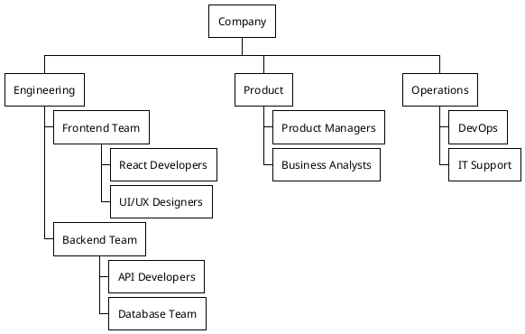

### Example 2: Project Breakdown (WBS)

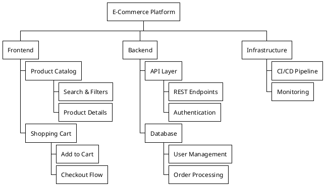

### Example 3: Knowledge Map (Mind Map)

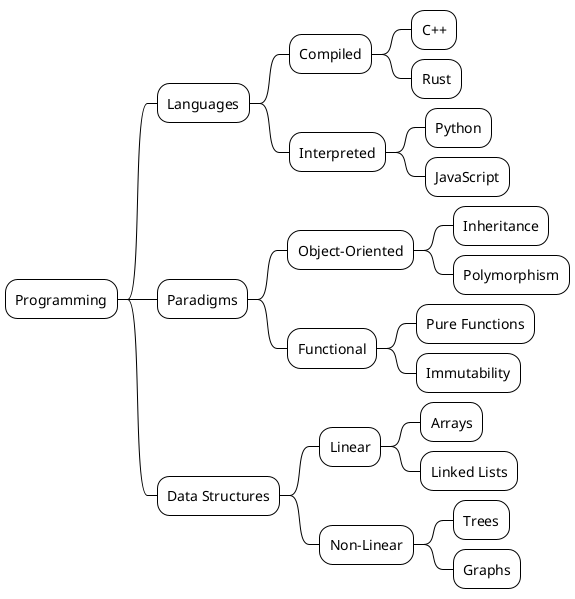

### Example 4: File Structure (Salt)

```plantuml
@startsalt File Structure
{
  {T
    + project/
    ++ src/
    +++ components/
    ++++ Header.tsx
    ++++ Footer.tsx
    +++ pages/
    ++++ Home.tsx
    ++++ About.tsx
    ++ tests/
    +++ unit/
    +++ integration/
    ++ package.json
    ++ README.md
  }
}
@endsalt
```

## Advanced Features

### Adding Colors (WBS/Mind Map)

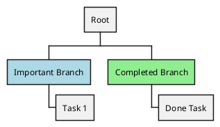

### Left and Right Branches (Mind Map)

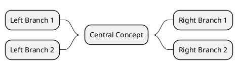

### Removing Boxes (WBS)

```plantuml
@startwbs
<style>
wbsDiagram {
  .box {
    BackgroundColor lightblue
  }
}
</style>
* Root
** Child
@endwbs
```

## Best Practices

- **Keep depth reasonable** (3-5 levels max)
- **Balance branches** - Avoid one very deep branch
- **Use consistent naming** - Similar items at same level
- **Group logically** - Related items together
- **Consider orientation** - Horizontal vs vertical
- **Add colors sparingly** - Highlight important items only

## Common Patterns

**Simple Hierarchy (WBS)**:
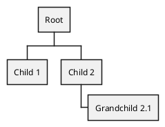

**Balanced Tree (Mind Map)**:
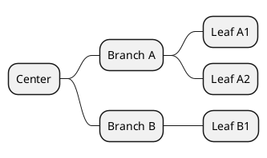

**File Tree (Salt)**:
```plantuml
@startsalt
{
  {T
    + folder/
    ++ file1.txt
    ++ file2.txt
  }
}
@endsalt
```

## When to Split Diagrams

If your tree has:
- More than 20 nodes → Split into multiple diagrams
- More than 5 levels deep → Consider restructuring
- Unbalanced (one branch very deep) → Create separate diagram for deep branch

Create focused diagrams rather than one massive tree.
